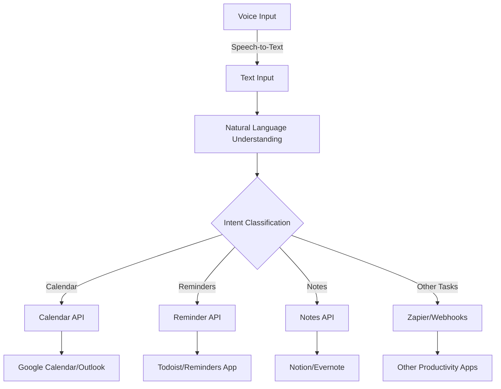

# Voice-Controlled Personal Assistant

This project is a voice-controlled personal assistant designed to automate calendar management, reminders, and note-taking using natural language processing and various productivity app integrations.

## System Architecture

## Components

1. **Voice Input**: Captures user's voice commands.
2. **Speech-to-Text**: Converts voice input to text using Whisper or NB-Whisper models.
3. **Natural Language Understanding**: Processes the text to understand user intent.
4. **Intent Classification**: Determines the type of task (Calendar, Reminders, Notes, or Other).
5. **API Integrations**: Connects with various productivity apps to execute tasks.
6. **Zapier/Webhooks**: Handles tasks that don't fit into predefined categories.

## Features

- Voice command recognition
- Multi-language support
- Integration with popular productivity apps
- Extensible architecture for adding new functionalities

## Getting Started

(Include instructions on how to set up and run the project)

## Dependencies

- Python 3.x
- Streamlit
- Whisper
- (List other major dependencies)

## Usage

(Provide examples of how to use the voice assistant)

## Contributing

(Instructions for potential contributors)

## License

(Specify the license under which this project is released)

---

This project is currently under development. For more information or to contribute, please contact [Your Name/Contact Information].